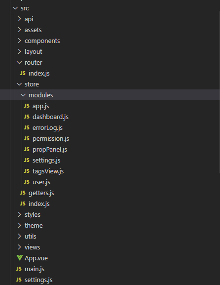

## 1. IDE
> IDE之于程序员，犹如剃刀之于理发师，关键在于用的顺手，因此我们并不希望强制程序员使用某一个IDE，也不在此比较各个IDE的优劣，只是如果你实在不想花时间在IDE的选择上，那么可以继续阅读下面的内容。

### 1.1 VS Code
#### 1.1.1 插件
- Vue VS Code Extension Pack  
该插件基本就是vue的全家桶了，包括了语法支持的Vetur，代码快速补全的Vue VSCode snippets，代码格式美化的Prettier，支持ES6语法的code snippets，以及括号提醒的Bracket Pair Colorizer等，差不多应有尽有了。

- carbon-now-sh
这是一个代码截图的插件，能让共享的代码有mac下的效果，哈哈，推荐一下，我看很多博客和自媒体都使用这个。

#### 1.1.2 快捷键
这块儿就直接贴配置了，用快捷键`ctr+shift+p`打开settings.json文件，贴入如下内容：
```
"vetur.format.defaultFormatter.html": "js-beautify-html",
  "vetur.format.defaultFormatterOptions": {
    // 对属性进行换行。
    // - auto: 仅在超出行长度时才对属性进行换行。
    // - force: 对除第一个属性外的其他每个属性进行换行。
    // - force-aligned: 对除第一个属性外的其他每个属性进行换行，并保持对齐。
    // - force-expand-multiline: 对每个属性进行换行。
    // - aligned-multiple: 当超出折行长度时，将属性进行垂直对齐。
    "js-beautify-html": {
      "wrap_line_length": 120,
      "wrap_attributes": "auto",
      "end_with_newline": false
    },
    "prettier": {
      "semi": false, //不使用分号结尾
      "singleQuote": true, //使用单引号
      "eslintIntegration": true  //开启 eslint 支持
    }
  },
  
  "eslint.validate": [
    "javascript",
    "javascriptreact",
    "html",
    "vue"
  ],
  //根据文件后缀名定义vue文件类型
  "files.associations": {
    "*.vue": "vue"
  },
  "eslint.run": "onSave",
  "java.refactor.renameFromFileExplorer": "autoApply",
  "[vue]": {
    "editor.defaultFormatter": "esbenp.prettier-vscode"
  },
  "graphvizPreview.dotPath": "C:\\Program Files\\Graphviz 2.44.1\\bin\\dot.exe",
  //保存时eslint自动修复错误
//   "files.autoSave": "afterDelay"

```

## 2. 代码结构

> 基本上参照github上比较流行的vue-admin项目为模板，根据实际需要略作调整。



src目录下的文件：
- main.js 整个项目的入口文件，可以在此文件中引入一些全局使用的三方库，比如ElementUI、echarts、fontawesome等，主要功能是new一个Vue对象出来。
- App.vue 项目的根组件，对于多菜单的中大型项目，在该文件中使用router-view来实现页面路由。
- settings.js 项目全局的配置文件，比如项目名称等信息；对于多项目的应用场景，也可以在此文件中根据项目定义多个对象。关于项目全局配置也有另外一种方案，参考：https://blog.csdn.net/u010468580/article/details/101209998
- router/index.js 路由管理配置文件
- assets 存放一些静态资源文件的目录，比如项目用到的图片文件以及一些json文件
- store 存放全局的vuex状态管理文件，对于一些大型的项目，为了避免状态管理的复杂性，会引入vuex进行统一的状态管理，当需要有多个模块的状态管理时，也可将文件按模块拆分成多个。 
- api 该目录下用来存放一些与后台交互的接口文件，但建议`只放置一些全局需要的接口，如果该接口只在单个模块中使用，则建议与模块定义放置在一个目录下`
- components 该目录下用来存放一些自定义的公共组件，比如自定义的按钮、表格等。
- styles 全局的样式文件，`建议使用scss样式`，方便代码引入
- utils 一些公用的方法可以放置在此目录下，类似一个工具集
- views 本质上也是组件，但是该目录下的文件是和router定义的页面一一对应的，最好一个菜单模块对应一个子目录，该子目录下又可定义api/component/mixin/store等子目录，用来存放仅和该模块相关的一些文件。

## 3. 命名规范
### 3.1 文件夹命名
- 由名词构成，如dashboard、dataset等
- 单词只能有一个，不好的例子：dashboardInfo、demoPage
- 以小写开头

### 3.2 vue文件命名
- 尽量是名词
- 大写开头，开头的单词是所属模块的名字
- 名字至少两个单词，如DashboardInfo、TableDetail

### 3.3 方法命名
#### 3.3.1 方法放置顺序
1. components
2. props
3. data
4. created
5. mounted
6. activited
7. update
8. beforeRouteUpdate
9. methods
10. filter
11. computed
12. watch

#### 3.3.2 自定义方法命名
- 动宾短语，如jumpPage，showDetail，反例：go/show
- 事件方法以on开头，如onClick，onTypeChange
- 避免一些有可能被框架使用的敏感单词，如init,refresh等
- 尽量使用常用单词开头，如set/get/open/close/show等
- 驼峰命名，比如getDataList，而不是get-data-list

## 4. 打包规范
### 4.1 手动打包
直接使用`npm run build`命令即可在dist目录下生成编译以后的文件。

### 4.2 CI流程
基于Jenkins搭建CI流程：
- 项目下编写jenkinsfile文件
- jenkins上新建对应的project，配置读取jenkinsfile
- gitlab上的project增加对应的webhook
- 以后提交代码即可以触发代码打包流程
详细的例子可参考SwiftBI的例子。

## 5. 代码调试
- 最常用的一种方式是通过console.log将相应的变量打印输出到浏览器的console，这种方式的优点是方便快捷，但缺点是代码中会增加很多无用的调试代码，影响代码的观感。
- 在需要调试的代码处输入debugger指令，那么程序在运行到此处时会自动进入调试模式
- 使用chrome浏览器时最好使用vue-devtools的插件（该插件需要从github上下载源码进行编译使用）,该插件会大大提高vue项目开发的效率，可以使用该插件查看每一步的vuex状态变化以及一些vue对应的组件信息。

## 6. 最佳实践
### 6.1 data/props方法注意事项
- data里的变量在使用前需要初始化
- props指定数据类型
- props改变父组件数据，基础类型用$emit，复杂类型直接改
- http请求数据前后用上isLoading变量
- 表单数据包裹一层form

### 6.2 生命周期注意事项
- 不在mounted、created之类的方法中写异步获取数据的逻辑
- 在created里面监听Bus事件

## 参考资料
- https://segmentfault.com/a/1190000009805187